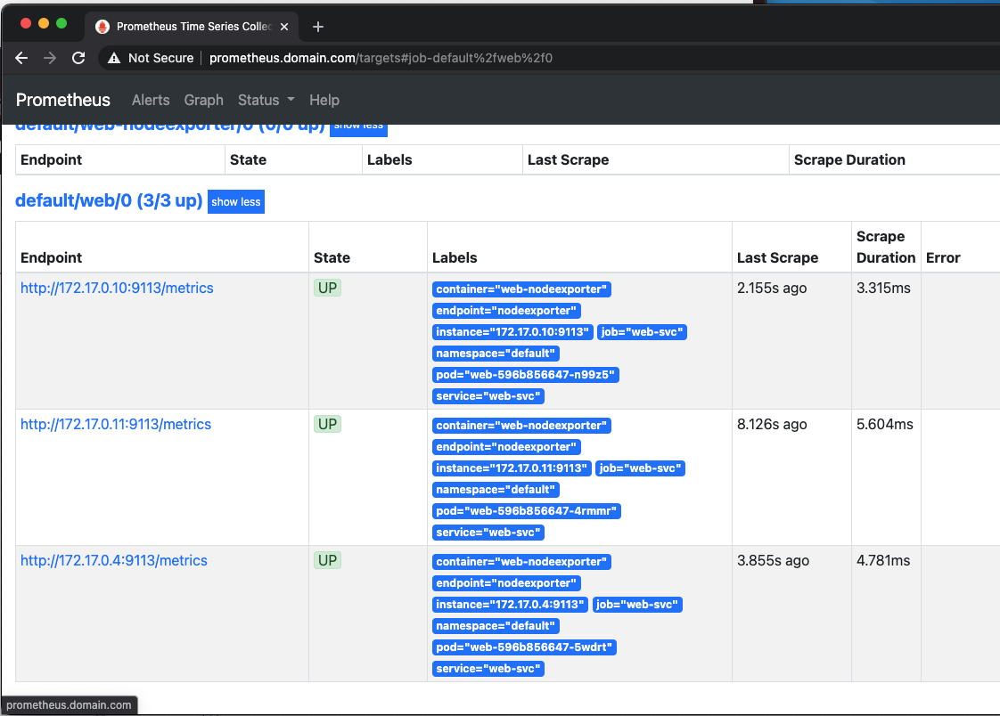

# Kubernetes Monitoring

---

### Prometheus Operator

- Выбираем уровень сложности "Can i play, daddy?"


- Установка kube-prometheus-stack через helm3

```helm upgrade --install prometheus prometheus-community/kube-prometheus-stack -f kube-prometheus-stack/values.yaml```

- Добавление ingress domain's в /etc/hosts

```192.168.64.10 alertmanager.domain.com```
```192.168.64.10 prometheus.domain.com```
```192.168.64.10 grafana.domain.com```
```192.168.64.10 web.domain.com```

- Создание нового образа web с пробросом basic_status

```docker push sergeykudelin/otus-k8s-web:wtstatus```

- Создаем и применяем новый deployment & service & ingress & servicemonitor

```for f in $(ls | grep web); do kubectl apply -f $f; done;```

- Чекаем доступность всех сервисов через Ingress и проверяем наличие метрик
- Prometheus



- Grafana


# Kubernetes Logging

```
kubectl create ns microservices-demo
kubectl apply -f https://raw.githubusercontent.com/express42/otus-platform-snippets/master/Module-02/Logging/microservices-demo-without-resources.yaml
```

```
helm repo add fluent https://fluent.github.io/helm-charts
helm repo add elastic https://helm.elastic.com
```

```
kubectl create ns observability
# ElasticSearch
helm upgrade --install elasticsearch elastic/elasticsearch --namespace observability -f elasticsearch.values.yaml
# Kibana
helm upgrade --install kibana elastic/kibana --namespace observability -f kibana.values.yaml
# Fluent Bit
helm upgrade --install fluent-bit stable/fluent-bit --namespace observability -f fluentbit.values.yaml
```

```
helm repo add grafana https://grafana.github.io/helm-charts
```

```
helm upgrade --install  prometheus-operator prometheus-community/kube-prometheus-stack --namespace observability --create-namespace -f prometheus-operator.values.yaml
```

```
helm upgrade --install elasticsearch-exporter prometheus-community/prometheus-elasticsearch-exporter --set es.uri=http://elasticsearch-master:9200 --set serviceMonitor.enabled=true --namespace=observability

helm upgrade --install loki --namespace=observability helm upgrade --install promtail grafana/promtail --set "loki.serviceName=loki" --namespace=observability
```