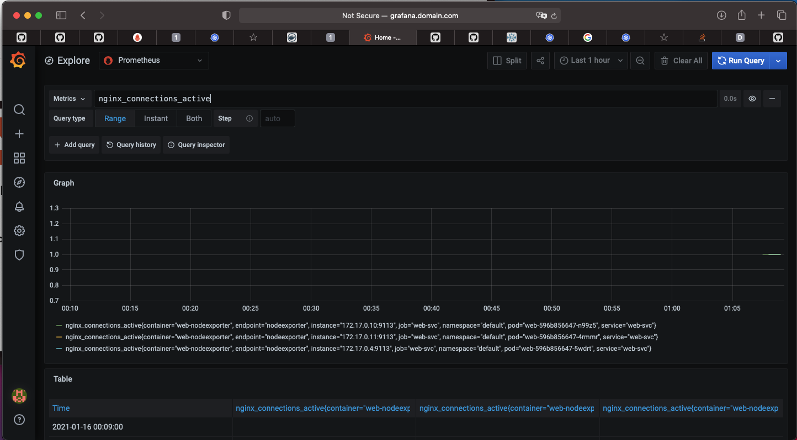

## Kubernetes Monitoring

---

### Prometheus Operator

- Выбираем уровень сложности "Can i play, daddy?"


- Установка kube-prometheus-stack через helm3

```helm upgrade --install prometheus prometheus-community/kube-prometheus-stack -f kube-prometheus-stack/values.yaml```

- Добавление ingress domain's в /etc/hosts

```192.168.64.10 alertmanager.domain.com```
```192.168.64.10 prometheus.domain.com```
```192.168.64.10 grafana.domain.com```
```192.168.64.10 web.domain.com```

- Создание нового образа web с пробросом basic_status

```docker push sergeykudelin/otus-k8s-web:wtstatus```

- Создаем и применяем новый deployment & service & ingress & servicemonitor

```for f in $(ls | grep web); do kubectl apply -f $f; done;```

- Чекаем доступность всех сервисов через Ingress и проверяем наличие метрик
- Prometheus


- Grafana


